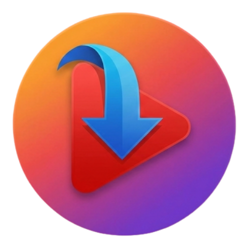

# 🎬 NeonDownloader - YouTube Video Downloader

A modern, cyberpunk-themed YouTube video downloader built with Next.js 16, featuring a stunning neon UI and mobile-first design.



## ✨ Features

- 🎨 **Cyberpunk/Neon Aesthetic** - Beautiful glassmorphic UI with neon accents
- 📱 **Mobile-First Design** - Optimized for mobile with bottom navigation
- 🔄 **PWA Support** - Install as a native app on any device
- ⚡ **Fast Downloads** - Stream videos directly without timeouts
- 🎵 **Audio Extraction** - Download as MP3 or MP4
- 🎯 **Quality Selection** - Choose from 360p to 4K
- 🌐 **No Limits** - No download restrictions or watermarks

## 🚀 Live Demo

**Production:** [https://neondownloader.onrender.com](https://neondownloader.onrender.com)

## 🛠️ Tech Stack

- **Framework:** Next.js 16 (App Router)
- **Styling:** Tailwind CSS 4
- **Animations:** Framer Motion
- **Video Processing:** @distube/ytdl-core
- **Icons:** Lucide React
- **Deployment:** Render

## 📦 Installation

```bash
# Clone the repository
git clone https://github.com/zandertechnory-lab/YTD.git
cd YTD

# Install dependencies
npm install

# Run development server
npm run dev
```

Open [http://localhost:3000](http://localhost:3000) to see the app.

## 🌐 Deployment

### Deploy to Render (Recommended)

1. **Fork/Clone this repository**
2. **Sign up at [Render](https://render.com)**
3. **Create a new Web Service**
   - Connect your GitHub repository
   - Select `zandertechnory-lab/YTD`
   - Render will auto-detect the `render.yaml` configuration
4. **Click "Create Web Service"**

That's it! Render will automatically:
- Install dependencies
- Build your app
- Deploy it live

### Manual Deployment Settings

If not using `render.yaml`:

| Setting | Value |
|---------|-------|
| **Build Command** | `npm install && npm run build` |
| **Start Command** | `npm start` |
| **Node Version** | 18.17.0 or higher |

## 📱 Mobile App (Play Store)

This app is PWA-ready and can be packaged as a Trusted Web Activity (TWA) for the Google Play Store:

1. Update `manifest.json` with your production URL
2. Use [Bubblewrap](https://github.com/GoogleChromeLabs/bubblewrap) to generate the APK
3. Submit to Play Store

## 🎨 Branding

- **Creator:** EmmaTechnocom
- **Partner:** Digital Flux
- **Design:** Cyberpunk/Neon theme with glassmorphism

## ⚠️ Important Notes

- **YouTube's Terms:** This tool is for educational purposes. Respect YouTube's Terms of Service.
- **Rate Limiting:** YouTube may block excessive requests. Use responsibly.
- **Render Free Tier:** 750 hours/month, sleeps after 15 minutes of inactivity.

## 🤝 Contributing

Contributions are welcome! Please feel free to submit a Pull Request.

## 📄 License

This project is open source and available under the MIT License.

## 🙏 Acknowledgments

- Built with [Next.js](https://nextjs.org)
- Video processing by [@distube/ytdl-core](https://github.com/distubejs/ytdl-core)
- Deployed on [Render](https://render.com)

---

**Made with ❤️ by EmmaTechnocom**
